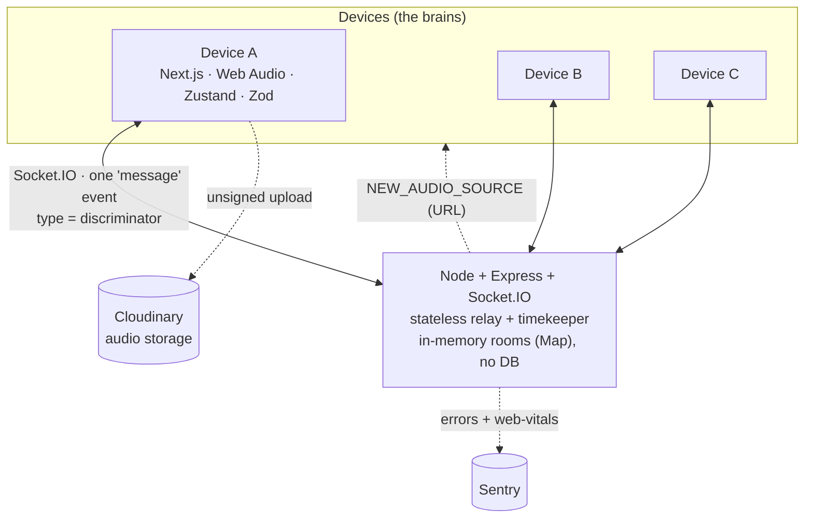
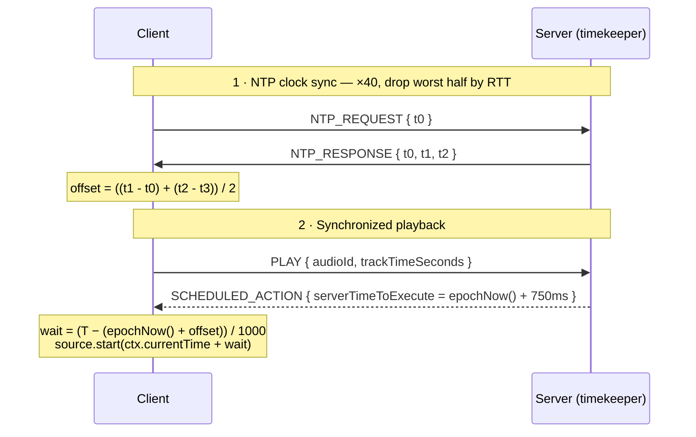

<div align="center">

# 🌀 Spanda

**Many devices, one clock, one sound field.**

Spanda (स्पन्द — *"vibration / pulse"*) turns any set of phones and laptops into a single, synchronized speaker array. Join a 6-digit room on multiple devices and they all play the same track to within **~10 milliseconds** — then add spatial audio, where a virtual sound source orbits the room and each device swells and fades in real time.

[**▶ Live demo**](https://spanda-woad.vercel.app) · Next.js · Node.js · Socket.IO · Web Audio API

</div>

---

## About Spanda

> Spanda turns any set of phones and laptops into one synchronized speaker array. You join a 6-digit room and every device plays the same track to within about 10 milliseconds. The hard part is clock sync: each device runs NTP over a WebSocket, takes 40 samples, drops the noisy half, and averages the rest to learn its offset from the server clock. Then I don't send *"play now"* — I broadcast *"play at server-time T"*, and each device schedules that on the Web Audio hardware clock, which is sample-accurate. The backend is a stateless Socket.IO relay with no database; all the intelligence lives on the clients.

---

## Features

- 🔑 **Rooms** — create/join by 6-digit code, random username, route-validated
- ⏱️ **NTP clock sync** — 40 samples, worst-half outlier rejection, live progress bar
- 🔊 **Sample-accurate sync playback** — play/pause/seek to the same millisecond across devices
- 📡 **Spatial audio** — a virtual source orbits the room (circle + figure-eight), per-client gain maps ramped smoothly ~30×/sec, plus a manual drag mode
- 📈 **Real-time visualizer** — radial FFT spectrum on the Web Audio `AnalyserNode`
- ☁️ **Direct-to-Cloudinary upload** — the browser uploads audio; the backend only relays the URL
- 🎚️ **Queue + autoplay** — shuffle / repeat, driver-elected auto-advance that re-syncs each track
- 🧩 **Typed message protocol** — one Socket.IO event, a Zod discriminated union validated on every inbound frame
- 🛰️ **Monitoring** — Sentry error + web-vitals tracking

---

## Architecture

The backend is deliberately "dumb": it **never stores audio, never tracks playback position, never decides what's playing.** It does three things — assign identity, stamp time, and fan out messages. Every device schedules playback itself against a shared clock it computed.



### The core trick — clock sync + scheduling



**Why this works:** `source.start(when)` hands the timestamp to the **audio hardware clock**, not a JS `setTimeout`. So every device fires at the exact same instant regardless of when its event loop happens to wake up. JS timers drift; the audio clock doesn't.

---

## Tech stack

| Layer | Technology | Role |
|---|---|---|
| Frontend | **Next.js (App Router) · TypeScript** | Owns the audio graph, clock-offset math, and all UI |
| UI | **Tailwind CSS · shadcn/ui · lucide** | Dark "control room" dashboard |
| Client state | **Zustand** | Global room / sync / audio / queue stores |
| Audio | **Web Audio API** | Sample-accurate scheduling + `AnalyserNode` visualizer |
| Realtime | **Socket.IO** | One persistent connection per device |
| Backend | **Node.js · Express · Socket.IO** | Stateless relay + timekeeper, in-memory rooms |
| Validation | **Zod** | The wire protocol; client validates every inbound frame |
| Uploads | **Cloudinary** | Browser uploads directly; URL becomes the shared track id |
| Monitoring | **Sentry** | Error + performance tracking |
| Hosting | **Vercel** (frontend) · **Render** (backend) | WebSockets in production |

**Why no database?** Rooms are ephemeral — they have no meaning once empty. State lives in a `Map` in server memory and dies when the room empties. Persistence would be over-engineering; I'd add it only for per-user saved playlists.

---

## Project structure

```
spanda/
├── frontend/                     # Next.js app → Vercel
│   └── src/
│       ├── app/                  # join screen + /room/[roomId]
│       ├── components/           # WebSocketManager, Visualizer, AudioControls, UserGrid, …
│       ├── store/                # Zustand: room · sync · audio · queue
│       └── lib/                  # schemas (Zod) · ntp · playback · epochNow · spatial
└── backend/                      # Express + Socket.IO → Render
    └── src/
        ├── index.js              # server + connection/message handlers
        ├── roomManager.js        # in-memory rooms + circle positioning
        ├── spatial.js            # orbit motion + per-client gain maps
        └── epochNow.js           # monotonic clock (matches the client)
```

---

## Run it locally

**Prerequisites:** Node 18+, and (optional, for uploads) a free Cloudinary account.

```bash
# 1) Backend
cd backend
npm install
npm run dev            # http://localhost:8080

# 2) Frontend (new terminal)
cd frontend
npm install
npm run dev            # http://localhost:3000
```

Create `frontend/.env.local`:

```
NEXT_PUBLIC_BACKEND_URL=http://localhost:8080
NEXT_PUBLIC_CLOUDINARY_CLOUD_NAME=your_cloud_name
NEXT_PUBLIC_CLOUDINARY_UPLOAD_PRESET=your_unsigned_preset
```

**Test multi-device:** open the room in two browser tabs, or on your phone via your machine's LAN IP (`http://192.168.x.x:3000`) on the same Wi-Fi. Wait for **Synced**, hit **Start System**, then **Play** — both devices fire together.

---

## Deployment

| Piece | Host | Notes |
|---|---|---|
| Frontend | **Vercel** | Root dir `frontend`; set `NEXT_PUBLIC_BACKEND_URL` to the Render URL |
| Backend | **Render** | Root dir `backend`; free tier supports WebSockets; set `CLIENT_ORIGIN` to the Vercel URL. Free instances sleep after ~15 min — a cron pings `/health` to keep it warm |

---

## Design decisions (interview lens)

- **Schedule, don't "play now".** JS timers drift and event loops are unpredictable. Broadcasting *"play at server-time T"* and scheduling on the audio hardware clock is the only way to hit the same instant on every device.
- **One event, a Zod discriminated union.** A single typed protocol with one source of truth; the client rejects any frame that doesn't match the schema, so a malformed message is caught at the boundary instead of corrupting state.
- **Zustand over Redux.** Global audio/sync state is updated from the socket handler, audio callbacks, and the UI — Zustand shares it without the boilerplate.
- **Stateless backend.** All intelligence lives on the clients; the server only assigns identity, stamps time, and fans out messages.

**Numbers to know:** ~10 ms sync accuracy · 40 NTP samples (worst 50% discarded) · 750 ms schedule lead · spatial gain maps ~30×/sec · monotonic `performance.now()` timestamps.

## What I'd improve next

- A **host role** so playback control isn't last-write-wins.
- **Server-side Zod validation** with the same schemas, instead of trusting clients.
- **Rate-limited reconnection** so a flaky mobile network re-syncs cleanly.
- Sentry **tunnel route** so ad-blockers don't drop production errors.

---

<div align="center">
Built by <a href="https://github.com/Muditgolaa">Muditgolaa</a> · <a href="https://spanda-woad.vercel.app">live demo</a>
</div>
